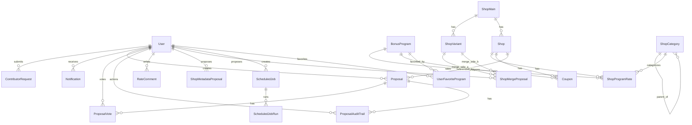

# Datenmodell & Workflows

Übersicht über die Datenstruktur und wichtige Prozesse im Shopping Points Optimiser.

## 📊 Datenmodell

### Kern-Entitäten

#### Graphische Darstellung (Mermaid)



```
┌─────────────────────────────────────────────────────────────────────┐
│                         SHOP HIERARCHY                               │
└─────────────────────────────────────────────────────────────────────┘

                 (A) 1:N Varianten
┌───────────────────────┐                ┌───────────────────────┐
│   ShopMain            │──────────────►│   ShopVariant         │
├───────────────────────┤               ├───────────────────────┤
│ id (UUID)             │               │ id                    │
│ canonical_name        │               │ shop_main_id → ShopMain.id
│ canonical_name_lower  │               │ source / source_name  │
│ website               │               │ source_id (optional)  │
│ logo_url              │               │ confidence_score      │
│ status                │               │ created_at            │
│ merged_into_id        │               └───────────────────────┘
│ created_at            │
│ updated_at            │
│ updated_by_user_id    │
└───────────────────────┘
      │
      │ (B) 1:N Shops  (direkt, NICHT über ShopVariant)
      ▼
┌───────────────────────┐
│   Shop                │  ← Konkrete Shop-Instanz (legacy, wird konsolidiert)
├───────────────────────┤
│ id                    │
│ name                  │
│ shop_main_id → ShopMain.id
│ created_at            │
└───────────────────────┘
      │
      │ (C) 1:N Raten
      ▼
┌───────────────────────┐
│   ShopProgramRate     │  ← Cashback/Punkte Raten
├───────────────────────┤
│ id                    │
│ shop_id → Shop.id     │  (NICHT ShopMain!)
│ program_id → BonusProgram.id
│ points_per_eur        │
│ points_absolute       │
│ cashback_pct          │
│ cashback_absolute     │
│ rate_type             │  "shop" | "contract"
│ rate_note             │
│ category_id → ShopCategory.id (optional)
│ valid_from            │
│ valid_to              │  NULL = aktuell gültig
└───────────────────────┘

┌───────────────────────┐
│   BonusProgram        │  ← Bonusprogramme (Payback, Miles&More, etc.)
├───────────────────────┤
│ id                    │
│ name                  │
│ point_value_eur       │
└───────────────────────┘
```

**Beziehungsregeln (klar & eindeutig):**

1. **ShopMain → ShopVariant = 1:N** (Varianten-Namen)
2. **ShopMain → Shop = 1:N** (direkte Verknüpfung; *nicht* über ShopVariant)
3. **Shop → ShopProgramRate = 1:N** (Raten hängen an Shop, nicht an ShopMain)
4. **ShopProgramRate → BonusProgram = N:1** (jede Rate gehört zu einem Bonusprogramm)

---

## ✅ Vollständiges Datenmodell (alle SQLAlchemy-Modelle)

### Core

```
User
  - id, username, email, password_hash, role, status, created_at

ContributorRequest
  - user_id → User.id
  - decision_by_admin_id → User.id
  - status, created_at, decision_at

BonusProgram
  - id, name, point_value_eur, created_at
```

### Shops & Raten

```
ShopMain
  - id, canonical_name, canonical_name_lower, website, logo_url
  - status, merged_into_id → ShopMain.id
  - updated_by_user_id → User.id

ShopVariant
  - shop_main_id → ShopMain.id
  - source, source_name, source_id, confidence_score

Shop
  - shop_main_id → ShopMain.id

ShopProgramRate
  - shop_id → Shop.id
  - program_id → BonusProgram.id
  - category_id → ShopCategory.id (optional)
  - points_per_eur, cashback_pct, rate_type, valid_from, valid_to

ShopCategory
  - parent_id → ShopCategory.id (self-referenzierend)
```

### Coupons

```
Coupon
  - shop_id → Shop.id (optional)
  - program_id → BonusProgram.id (optional)
  - coupon_type, value, combinable, valid_from, valid_to, status
```

### Proposals & Reviews

```
Proposal
  - user_id → User.id
  - shop_id → Shop.id (optional)
  - program_id → BonusProgram.id (optional)
  - proposal_type, status, source, source_url, proposed_* fields

ProposalVote
  - proposal_id → Proposal.id
  - voter_id → User.id

ProposalAuditTrail
  - proposal_id → Proposal.id
  - actor_id → User.id (optional)

ShopMergeProposal
  - variant_a_id → ShopVariant.id (behalten)
  - variant_b_id → ShopVariant.id (mergen)
  - proposed_by_user_id → User.id
  - decided_by_user_id → User.id (optional)

ShopMetadataProposal
  - shop_main_id → ShopMain.id
  - proposed_by_user_id → User.id
  - decided_by_user_id → User.id (optional)

RateComment
  - rate_id → ShopProgramRate.id
  - reviewer_id → User.id
```

### Jobs, Logs & Notifications

```
ScheduledJob
  - created_by_user_id → User.id (optional)
  - job_name, job_type, cron_expression, enabled

ScheduledJobRun
  - scheduled_job_id → ScheduledJob.id
  - status, message, created_at

Notification
  - user_id → User.id
  - notification_type, title, message, link_type, link_id, is_read

ScrapeLog
  - timestamp, message
```

### User Preferences

```
UserFavoriteProgram
  - user_id → User.id
  - program_id → BonusProgram.id
  - (UniqueConstraint: user_id + program_id)
```

**Hinweis:** Einige Beziehungen sind nur über Foreign Keys definiert (keine explizite ORM-Relation), sind aber funktional vorhanden.

---

### Proposal-System

```
┌─────────────────────────────────────────────────────────────────────┐
│                         PROPOSAL TYPES                               │
└─────────────────────────────────────────────────────────────────────┘

┌───────────────────────┐
│   Proposal            │  ← Allgemeine Proposals (Raten, Shops, URLs)
├───────────────────────┤
│ id                    │
│ proposal_type         │  "url" | "rate_change" | "shop_add" |
│                       │  "program_add" | "coupon_add"
│ status                │  "pending" | "approved" | "rejected"
│ source                │  "user" | "browser_extension" | "scraper"
│ user_id               │  → User.id
│ shop_id               │  → Shop.id (optional)
│ program_id            │  → BonusProgram.id (optional)
│ source_url            │  URL für "url" proposals
│ proposed_*            │  Verschiedene Felder je nach Type
│ created_at            │
│ approved_at           │
└───────────────────────┘

┌───────────────────────┐
│ ShopMetadataProposal  │  ← Shop-Metadaten ändern (Name, Website, Logo)
├───────────────────────┤
│ id                    │
│ shop_main_id          │  → ShopMain.id
│ proposed_name         │  Neuer Name (optional)
│ proposed_website      │  Neue Website (optional)
│ proposed_logo_url     │  Neues Logo (optional)
│ reason                │  Begründung
│ proposed_by_user_id   │  → User.id
│ status                │  "PENDING" | "APPROVED" | "REJECTED"
│ created_at            │
│ decided_at            │
│ decided_by_user_id    │  → User.id
│ decided_reason        │  Bei Ablehnung
└───────────────────────┘

┌───────────────────────┐
│ ShopMergeProposal     │  ← Shops zusammenführen
├───────────────────────┤
│ id                    │
│ variant_a_id          │  → ShopVariant.id (behalten)
│ variant_b_id          │  → ShopVariant.id (mergen)
│ proposed_by_user_id   │  → User.id
│ status                │  "PENDING" | "APPROVED" | "REJECTED"
│ reason                │  Begründung
│ created_at            │
│ decided_at            │
│ decided_by_user_id    │  → User.id
│ decided_reason        │  Bei Ablehnung
└───────────────────────┘
```

---

## 🔄 Workflow: URL-Proposal (Browser Extension)

### Schritt-für-Schritt

**1. User besucht unbekannte Website**
```
Browser Extension prüft: GET /api/shop/by_url?url=https://example.com
→ Response: {"found": false}
```

**2. Extension zeigt "Shop nicht erkannt"**
```
UI zeigt:
- Shop-Auswahl (Dropdown)
- URL-Eingabe (automatisch gefüllt)
- "Vorschlag einreichen" Button
```

**3. User wählt Shop & sendet Proposal**
```javascript
POST /api/proposals/url
Body: {
  "shop_id": 123,
  "url": "https://example.com"
}

→ Erstellt: Proposal
  - proposal_type = "url"
  - shop_id = 123
  - source_url = "https://example.com"
  - status = "pending"
  - source = "browser_extension"
```

**4. Admin sieht Proposal im Dashboard**
```
Admin → Tab "Beiträge" → Pending Proposals
- Sieht: "URL Proposal für Shop XYZ"
- Details: URL, User, Datum
```

**5. Admin approved Proposal**
```python
POST /approve/<proposal_id>

→ approve_proposal() in proposals.py
→ elif proposal.proposal_type == "url":
    shop = Shop.query.get(proposal.shop_id)
    shop_main = ShopMain.query.get(shop.shop_main_id)
    shop_main.website = proposal.source_url  # ← URL wird geschrieben
    shop_main.updated_at = NOW
    proposal.status = "approved"
```

**6. Result**
```
✅ ShopMain.website = "https://example.com"
✅ Extension erkennt Shop beim nächsten Besuch
✅ URL wird überall angezeigt (Admin, Frontend)
```

---

## 🔀 Workflow: Shop Merge

### Überblick

Wenn zwei ShopMain-Einträge denselben Shop repräsentieren, können sie gemerged werden.

```
VORHER:
ShopMain A: "Amazon"
  ├─ Shop 1: rates: [Payback: 1 P/€, Miles: 2 P/€]
  └─ ShopVariant: "Amazon.de"

ShopMain B: "amazon.de"
  ├─ Shop 2: rates: [TopCashback: 3%]
  └─ ShopVariant: "Amazon Deutschland"

NACHHER (A ← B):
ShopMain A: "Amazon"  (status=active)
  ├─ Shop 1: rates: [Payback: 1 P/€, Miles: 2 P/€, TopCashback: 3%]
  ├─ ShopVariant: "Amazon.de"
  └─ ShopVariant: "Amazon Deutschland" ← verschoben

ShopMain B: "amazon.de"  (status=merged, merged_into_id=A.id)
  └─ (leer)
```

### Schritt-für-Schritt

**1. Admin erstellt Merge Proposal**
```
Admin → Tab "Shops bearbeiten" → Merge-Vorschläge
- Wählt Variante A (behalten)
- Wählt Variante B (mergen)
- Klickt "Merge vorschlagen"
```

**2. System erstellt ShopMergeProposal**
```python
ShopMergeProposal
  variant_a_id = X  # ← Shop A behalten
  variant_b_id = Y  # ← Shop B mergen
  status = "PENDING"
```

**3. Admin approved Merge**
```python
POST /admin/shops/merge_proposal/<id>/approve

→ approve_merge_proposal()
  # Hole ShopMain IDs
  main_keep = variant_a.shop_main_id   # A
  main_merge = variant_b.shop_main_id  # B

  # Führe Merge aus
  merge_shops(target_main_id=A, source_main_id=B)
```

**4. merge_shops() Funktion**
```python
def merge_shops(target_main_id, source_main_id):
    # 1. Verschiebe alle ShopVariants von B → A
    ShopVariant.query.filter_by(shop_main_id=B).update({
        "shop_main_id": A
    })

    # 2. Verschiebe alle Shops von B → A
    Shop.query.filter_by(shop_main_id=B).update({
        "shop_main_id": A
    })

    # 3. Konsolidiere Raten (merge zu erstem Shop von A)
    from_shops = Shop.query.filter_by(shop_main_id=B).all()
    target_shop = Shop.query.filter_by(shop_main_id=A).first()

    for from_shop in from_shops:
        # Verschiebe alle Raten
        ShopProgramRate.query.filter_by(shop_id=from_shop.id).update({
            "shop_id": target_shop.id
        })

    # 4. Markiere B als gemerged
    shop_main_B.status = "merged"
    shop_main_B.merged_into_id = A
```

**5. Result**
```
✅ Alle Varianten jetzt unter ShopMain A
✅ Alle Raten konsolidiert in einem Shop
✅ ShopMain B hat status="merged"
✅ Suche findet Shop über alle Varianten
```

### Wichtige Regeln

1. **Merge-Richtung:** `variant_a` = **behalten**, `variant_b` = **mergen**
2. **Raten:** Werden alle zum **ersten Shop** von target_main verschoben
3. **Varianten:** Bleiben erhalten, nur `shop_main_id` ändert sich
4. **Status:** Source ShopMain wird `status="merged"`, nicht gelöscht
5. **Rollback:** Theoretisch möglich über `merged_into_id` Relation

---

## 🔍 Workflow: Shop-Suche

### Suchlogik

Die Suche durchsucht **sowohl ShopMain als auch ShopVariant Namen**:

```python
GET /shop_names?q=1+und+1

→ Suche in:
  - ShopMain.canonical_name_lower LIKE '%1 und 1%'
  - ShopVariant.source_name ILIKE '%1 und 1%'  (case-insensitive)

→ Result:
  [{"id": 123, "name": "1&1 Internet und Telefon"}]

  ✅ Gefunden über ShopVariant "1 und 1" (manual)
```

### Warum beide Tabellen?

- **ShopMain:** Kanonischer Name (meist von erster Quelle)
- **ShopVariant:** Alternative Namen von Google, Amazon, Scrapern, manuell

**Beispiel:**
```
ShopMain: "1&1 Internet und Telefon"
Varianten:
  - Google: "1 and 1"
  - Amazon: "1&1"
  - manual: "1 und 1"

Suche findet Shop bei:
✅ "1&1"
✅ "1 und 1"
✅ "1 and 1"
✅ "internet"
```

---

## 🛠️ Admin-Funktionen

### Varianten verwalten

**Hinzufügen:**
```
Admin → Shop Details → "➕ Variante hinzufügen"
POST /admin/shops/<shop_main_id>/variants
Body: {
  "source": "manual",
  "source_name": "Alternative Name",
  "source_id": null,
  "confidence_score": 100.0
}
```

**Löschen:**
```
Admin → Shop Details → Variante → "🗑️"
POST /admin/variants/<variant_id>/delete
```

**Wichtig:** Raten sind an `Shop.id` gebunden, nicht an Varianten!
→ Variante löschen = sicher, Raten bleiben erhalten

### Shop-Status

- **active:** Normal sichtbar und suchbar
- **merged:** In anderen Shop gemerged, nicht mehr sichtbar
- **deleted:** Soft-deleted, nur mit Filter sichtbar

**Löschen/Wiederherstellen:**
```
POST /admin/shops/<shop_main_id>/delete   → status="deleted"
POST /admin/shops/<shop_main_id>/restore  → status="active"
```

---

## 🔐 Berechtigungen

| Aktion | Viewer | User | Contributor | Admin |
|--------|--------|------|-------------|-------|
| Proposals erstellen | ❌ | ✅ | ✅ | ✅ |
| Proposals approven | ❌ | ❌ | ❌ | ✅ |
| Shops mergen | ❌ | ❌ | ❌ | ✅ |
| Varianten hinzufügen | ❌ | ❌ | ❌ | ✅ |
| Shops löschen | ❌ | ❌ | ❌ | ✅ |

---

## 📝 Wichtige Hinweise

### Daten-Integrität

1. **Shop vs. ShopMain:** `Shop` ist legacy, wird schrittweise konsolidiert
2. **Raten an Shop, nicht ShopMain:** Raten sind an `Shop.id` gebunden
3. **Merge bewahrt Raten:** Alle Raten werden zum ersten Shop verschoben
4. **Varianten sind Metadata:** Haben keine direkten Raten, nur Namen

### Performance

- **Indizes:** `canonical_name_lower`, `shop_main_id`, `shop_id` sind indiziert
- **Suche:** ILIKE ist langsam bei großen Datenmengen → evtl. Fulltext-Index
- **Distinct:** Merge-Query nutzt `.distinct()` um Duplikate zu vermeiden

### Migration

Das Datenmodell ist in Transition:
- **Alt:** Ein `Shop` pro Scraper/Quelle → viele Duplikate
- **Neu:** Ein `ShopMain` mit mehreren `ShopVariant` → dedupliziert
- **Ziel:** Alle `Shop` zu einem pro `ShopMain` konsolidieren

---

## 🐛 Debugging

### Häufige Probleme

**Problem:** URL wird nach Approval nicht angezeigt
→ **Fix:** Stelle sicher, dass `proposal_type="url"` Block existiert in `approve_proposal()`

**Problem:** Merge verschiebt Raten nicht
→ **Fix:** Raten manuell verschieben: `UPDATE shop_program_rates SET shop_id=X WHERE shop_id=Y`

**Problem:** Suche findet Shop nicht
→ **Check:** Sind Varianten vorhanden? `SELECT * FROM shop_variants WHERE shop_main_id='...'`

**Problem:** Shop hat mehrere `Shop` Einträge
→ **Info:** Normal während Migration, werden bei Merge konsolidiert

### Nützliche Queries

```sql
-- Alle Shops mit ihren Varianten
SELECT sm.canonical_name, sv.source, sv.source_name
FROM shop_main sm
LEFT JOIN shop_variants sv ON sm.id = sv.shop_main_id
WHERE sm.status = 'active';

-- Alle Raten eines Shops
SELECT sm.canonical_name, bp.name, spr.points_per_eur, spr.cashback_pct
FROM shop_main sm
JOIN shops s ON s.shop_main_id = sm.id
JOIN shop_program_rates spr ON spr.shop_id = s.id
JOIN bonus_programs bp ON bp.id = spr.program_id
WHERE sm.id = 'xyz';

-- Pending Proposals
SELECT proposal_type, status, created_at
FROM proposals
WHERE status = 'pending';
```
